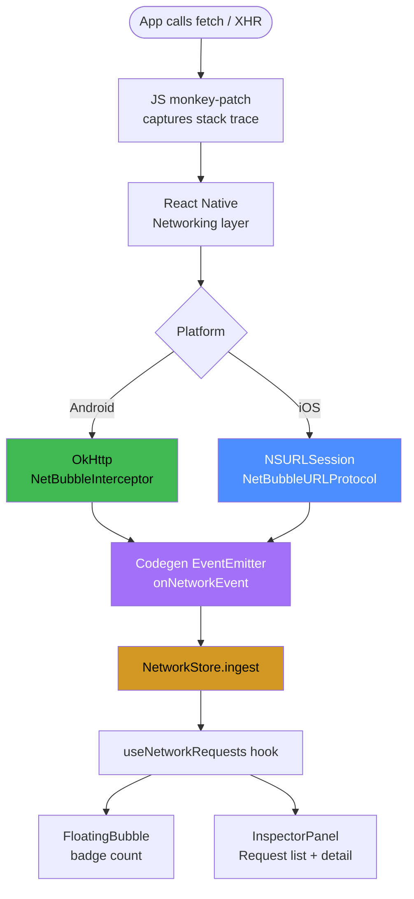
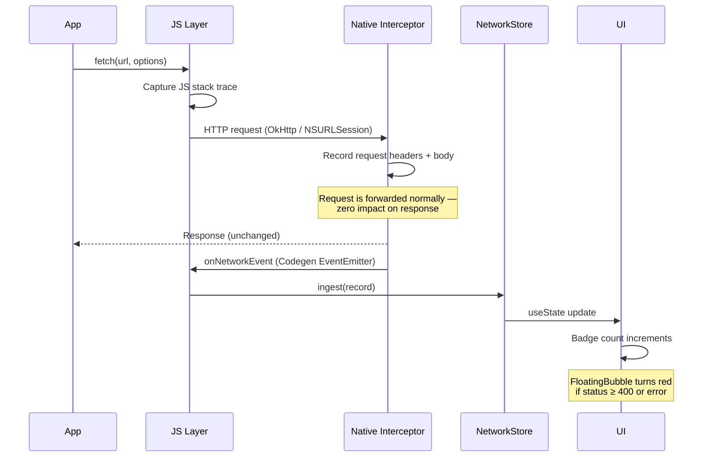
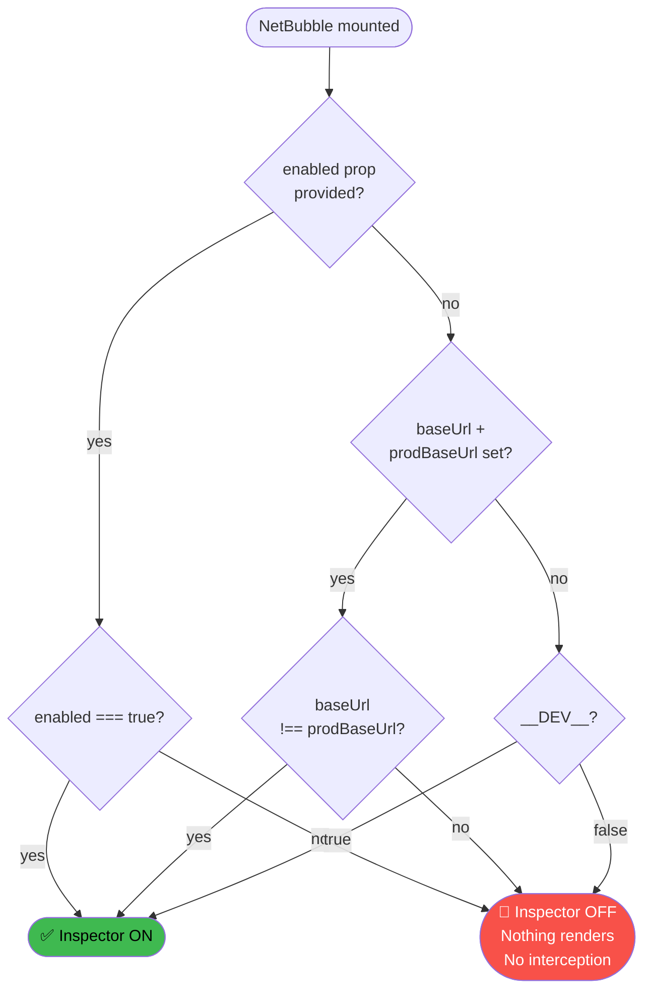
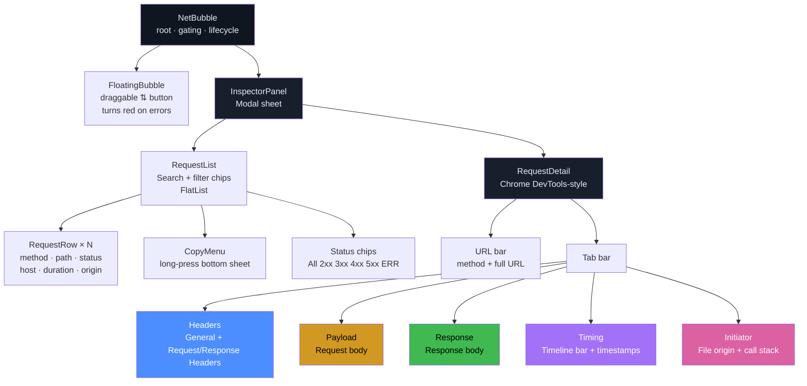
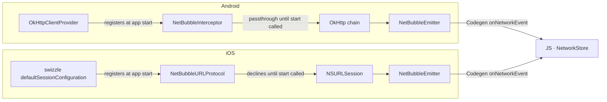

# react-native-net-bubble

> A self-contained, in-app network inspector for React Native — no laptop, no cable, no DevTools session required.

A draggable **floating bubble** lives above every screen. Tap it and a live, Chrome DevTools-style **Network panel** slides up showing every request as it happens: URL, method, headers, request/response bodies, status, timing, and — uniquely — **which file in your codebase fired the call**.

```
npm install react-native-net-bubble
yarn add react-native-net-bubble
```

> **New Architecture only.** Pure TurboModule (Codegen spec + event emitter). Requires React Native **0.79+** with the New Architecture enabled (the default on modern RN).

---

## Features

- 🔵 **Draggable floating bubble** — stays out of the way, snaps to either edge, turns 🔴 red when errors are present
- 🗂 **Chrome DevTools-style tabs** — Headers · Payload · Response · Timing · Initiator
- 🔍 **Search + status filter chips** — All · 2xx · 3xx · 4xx · 5xx · ERR, combined with free-text search
- 📋 **Copy as** — long-press any request to copy as cURL (bash), cURL (cmd), fetch, or raw response body
- 📤 **Export** — share the entire session as JSON with one tap
- 📂 **File-of-origin** — every request shows the exact `file:line` that called it
- ⏱ **Timing tab** — visual timeline bar + precise `HH:MM:SS.mmm` timestamps
- 🔒 **Zero-cost in production** — gating is evaluated before any component mounts; in prod nothing renders and nothing is intercepted
- 🚫 **No third-party runtime dependencies** — just React Native

---

## How it works

### Full pipeline



### Request lifecycle (sequence)



### Gating logic



### UI component tree



---

## Install

```sh
npm install react-native-net-bubble
# or
yarn add react-native-net-bubble
```

**iOS** — install pods after install:

```sh
cd ios && pod install && cd ..
```

**Android** — no extra steps. Autolinking + Codegen handle everything. There is nothing to register in `MainApplication` or `AppDelegate`.

Then rebuild the native app:

```sh
npx react-native run-ios
npx react-native run-android
```

---

## Quick start

Mount `<NetBubble />` once, near the root of your app, as the **last child** so it floats above all other content:

```tsx
import { NetBubble } from 'react-native-net-bubble';

export default function App() {
  return (
    <>
      <RootNavigator />
      {/* Always last so the bubble is above everything */}
      <NetBubble enabled={getApiBaseUrl() !== PROD_BASE_URL} />
    </>
  );
}
```

That's it. When `enabled` is `false`, `NetBubble` renders nothing and native interception never starts — safe to ship to production.

---

## Gating

Three ways to control when the inspector is active:

```tsx
// 1. Explicit boolean — recommended. Wire to your existing env flag.
<NetBubble enabled={getApiBaseUrl() !== PROD_BASE_URL} />

// 2. URL comparison — library does the comparison for you.
<NetBubble baseUrl={getApiBaseUrl()} prodBaseUrl={PROD_BASE_URL} />

// 3. Omit everything — defaults to __DEV__
<NetBubble />
```

Resolution order: `enabled` → `baseUrl !== prodBaseUrl` → `__DEV__`.

---

## Props

| Prop | Type | Default | Description |
|------|------|---------|-------------|
| `enabled` | `boolean` | `__DEV__` | Master switch. Wins over all other gating props. |
| `baseUrl` | `string` | — | Current API base URL. Used with `prodBaseUrl`. |
| `prodBaseUrl` | `string` | — | If `baseUrl === prodBaseUrl` the inspector is off. |
| `maxBodyBytes` | `number` | `1048576` | Max bytes captured per request body (1 MiB). |
| `maxRecords` | `number` | `500` | Max records kept in memory before oldest are dropped. |
| `bubbleColor` | `string` | `#4c8dff` | Bubble background colour (overridden to red on errors). |

---

## Inspector UI

### Floating bubble

The bubble lives in a persistent `position: absolute` overlay with `zIndex: 999999`. Drag it anywhere — it snaps to the nearest edge on release and remembers its position across mounts.

| State | Appearance |
|-------|------------|
| Normal | Blue (or `bubbleColor`) with white request-count badge |
| Errors present | Turns **red** automatically when any request has `status ≥ 400` or `state === 'error'` |

### Request list

```
┌────────────────────────────────────────────────┐
│  🔍  Filter by URL, method, file, status…      │
├────────────────────────────────────────────────┤
│  All  2xx  3xx  4xx  5xx  ERR                  │  ← status chips
├────────────────────────────────────────────────┤
│  POST  /v1/users                        201    │
│  api.example.com                       84ms    │
│  ⟶ src/screens/Profile.tsx:42                  │
├────────────────────────────────────────────────┤
│  GET   /v1/feed                         200    │
│  api.example.com                       120ms   │
└────────────────────────────────────────────────┘
```

- **Search** persists when you navigate into a detail view and back.
- **Status chips** filter instantly. Combine with text search.
- **Long-press** any row → Copy menu (see below).
- **Tap** a row → detail view.

### Copy menu (long-press)

```
┌──────────────────────────────────── ✕ ─┐
│  POST  /v1/users                        │
│  api.example.com                        │
├─────────────────────────────────────────┤
│  Copy URL                               │
│  Copy as cURL                           │  ← bash / zsh / PowerShell
│  Copy as cURL (cmd)                     │  ← Windows cmd.exe
│  Copy as fetch                          │  ← JS fetch() snippet
│  Copy Response Body                     │  ← only shown if response exists
└─────────────────────────────────────────┘
```

If [`@react-native-clipboard/clipboard`](https://github.com/react-native-clipboard/clipboard) is installed in your app, text lands directly on the clipboard and a **✓ Copied** toast appears. Otherwise the native Share sheet opens.

**cURL (bash) example:**
```bash
curl -X POST 'https://api.example.com/v1/users' \
  -H 'Content-Type: application/json' \
  -H 'Authorization: Bearer token' \
  --data-raw '{"name":"John"}'
```

**cURL (cmd) example:**
```cmd
curl -X POST "https://api.example.com/v1/users" ^
  -H "Content-Type: application/json" ^
  -H "Authorization: Bearer token" ^
  --data-raw "{\"name\":\"John\"}"
```

**fetch example:**
```js
await fetch('https://api.example.com/v1/users', {
  method: 'POST',
  headers: {
    'Content-Type': 'application/json',
    'Authorization': 'Bearer token',
  },
  body: '{"name":"John"}',
});
```

### Request detail tabs

Tap any row to open the detail view. Five tabs:

#### Headers
General info (URL, method, status, duration, content-type) + collapsible **Response Headers** and **Request Headers** sections with item counts.

#### Payload
Pretty-printed request body. JSON is auto-formatted. Includes an inline **⎘ Copy** button.

#### Response
Pretty-printed response body with inline **⎘ Copy** button. `content-type` response header is used for JSON detection.

#### Timing

```
10:23:45.042 ─────────────────── 10:23:45.276
[████████████████████████████████]
              234ms
```

Colour matches the status (green 2xx · yellow 3xx · red 4xx/5xx/error). Timestamps are shown at millisecond precision (`HH:MM:SS.mmm`).

#### Initiator
Source file + line number + function name that triggered the request, plus the full JS call stack.

All sections inside each tab are **collapsible** — tap the `▾`/`▸` header row to toggle.

---

## File-of-origin & symbolication

Every `NetworkRecord` carries a `.origin` field:

```ts
type RequestOrigin = {
  file: string;       // e.g. "src/screens/ProfileScreen.tsx"
  line?: number;      // e.g. 84
  column?: number;
  methodName?: string; // e.g. "loadUser"
  raw: string;         // raw stack frame
};
```

### In development (Metro connected)

Symbolication is automatic. The library calls Metro's `/symbolicate` endpoint and resolves bundle offsets to real `file:line` values. Zero config.

### In QA / release builds (no Metro)

Bundle a source map and register a resolver once at startup:

```ts
import { configureSymbolication } from 'react-native-net-bubble';
import { SourceMapConsumer } from 'source-map-js'; // install separately
import sourceMapJson from './app.bundle.map.json';

const consumer = new SourceMapConsumer(sourceMapJson);

configureSymbolication({
  resolveFrame: (frame) => {
    if (frame.line == null) return undefined;
    const pos = consumer.originalPositionFor({
      line: frame.line,
      column: frame.column ?? 0,
    });
    if (!pos.source) return undefined;
    return {
      file: pos.source.replace(/^.*\/src\//, 'src/'),
      line: pos.line ?? undefined,
      column: pos.column ?? undefined,
      methodName: pos.name ?? frame.methodName,
      raw: frame.raw,
    };
  },
});
```

Because production is gated out entirely, the source map only ships in builds that already exclude real users.

---

## Export session

The **Export** button (top-right of the list) calls `Share.share()` with a full JSON dump of all captured records — useful for attaching to bug reports or sharing with teammates:

```json
[
  {
    "id": "abc123",
    "method": "POST",
    "url": "https://api.example.com/v1/users",
    "status": 201,
    "duration": 234,
    "requestHeaders": { "Content-Type": "application/json" },
    "responseBody": "{\"id\":\"u_1\"}",
    ...
  }
]
```

---

## Custom UI / headless usage

The default bubble + panel are optional. Subscribe directly to the captured data and build your own UI:

```tsx
import { useNetworkRequests, networkStore } from 'react-native-net-bubble';

function MyInspector() {
  const records = useNetworkRequests(); // live NetworkRecord[]

  return (
    <FlatList
      data={records}
      renderItem={({ item }) => <Text>{item.url}</Text>}
    />
  );
}

// Clear all records
networkStore.clear();
```

Individual components are also exported for composition:

```tsx
import {
  FloatingBubble,
  InspectorPanel,
  RequestList,
  RequestDetail,
} from 'react-native-net-bubble';
```

### `NetworkRecord` type

```ts
type NetworkRecord = {
  id: string;
  method: string;
  url: string;
  requestHeaders: Record<string, string>;
  requestBody?: string;
  requestBodyTruncated: boolean;
  status?: number;
  statusText?: string;
  responseHeaders?: Record<string, string>;
  responseBody?: string;
  responseBodyTruncated: boolean;
  contentType?: string;
  startTime: number;   // epoch ms
  endTime?: number;    // epoch ms
  duration?: number;   // ms
  error?: string;
  state: 'pending' | 'success' | 'error';
  platform: string;    // "android" | "ios"
  stack?: string;      // raw JS stack
  origin?: RequestOrigin;
};
```

---

## Native interception deep-dive



- **Android:** `NetBubbleInterceptor` is an OkHttp `Interceptor` added to RN's client at startup via `OkHttpClientProvider`. It intercepts the full request/response cycle, capturing headers, status codes, and bodies up to `maxBodyBytes`.
- **iOS:** `NetBubbleURLProtocol` is registered into `NSURLSessionConfiguration` via method swizzling. It proxies the request through a private `NSURLSession` to capture the full exchange without affecting the response seen by the caller.
- **Gating:** Both interceptors start in a passive (pass-through) state. They only begin capturing after `native.start()` is called — which only happens when `isInspectorEnabled()` returns `true`.

---

## Limitations

- **New Architecture only** — TurboModule + Codegen event emitter. RN 0.79+.
- **WebView traffic is not captured.** `WKWebView` (iOS) runs out of process; Android `WebView` and image pipelines (Fresco / Glide) use separate HTTP stacks.
- **File-of-origin covers JS-initiated requests only.** Purely native-initiated traffic has no JS stack to attribute.
- **Bodies are capped** at `maxBodyBytes` (default 1 MiB). Binary content types (`image/*`, `audio/*`, `video/*`, etc.) are skipped entirely.

---

## Contributing

See [CONTRIBUTING.md](CONTRIBUTING.md).

The `example/` directory is a full React Native app wired to consume the library source directly:

```sh
# iOS
yarn example ios

# Android
yarn example android
```

---

## License

MIT © [Durgesh Kumar Dwivedi](https://github.com/2004durgesh)
